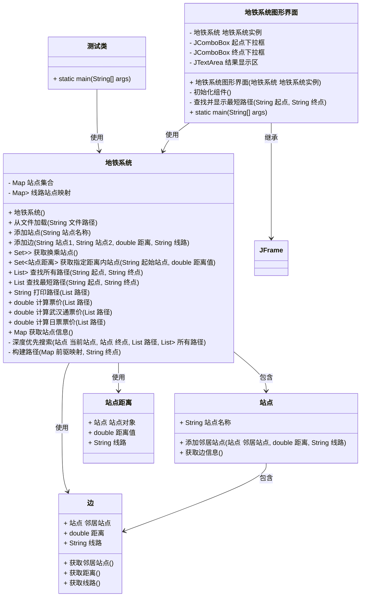

```mermaid
classDiagram
    class 地铁系统图形界面 {
        - 地铁系统 地铁系统实例
        - JComboBox<String> 起点下拉框
        - JComboBox<String> 终点下拉框
        - JTextArea 结果显示区
        + 地铁系统图形界面(地铁系统 地铁系统实例)
        - 初始化组件()
        - 查找并显示最短路径(String 起点, String 终点)
        + static main(String[] args)
    }

    class 地铁系统 {
        - Map<String, 站点> 站点集合
        - Map<String, List<String>> 线路站点映射
        + 地铁系统()
        + 从文件加载(String 文件路径)
        + 添加站点(String 站点名称)
        + 添加边(String 站点1, String 站点2, double 距离, String 线路)
        + Set<Map.Entry<String, Set<String>>> 获取换乘站点()
        + Set<站点距离> 获取指定距离内站点(String 起始站点, double 距离值)
        + List<List<String>> 查找所有路径(String 起点, String 终点)
        + List<String> 查找最短路径(String 起点, String 终点)
        + String 打印路径(List<String> 路径)
        + double 计算票价(List<String> 路径)
        + double 计算武汉通票价(List<String> 路径)
        + double 计算日票票价(List<String> 路径)
        + Map<Object, Object> 获取站点信息()
        - 深度优先搜索(站点 当前站点, 站点 终点, List<String> 路径, List<List<String>> 所有路径)
        - 构建路径(Map<String, String> 前驱映射, String 终点)
    }

    class 测试类 {
        + static main(String[] args)
    }

    class 站点 {
        + String 站点名称
        + 添加邻居站点(站点 邻居站点, double 距离, String 线路)
        + 获取边信息()
    }

    class 边 {
        + 站点 邻居站点
        + double 距离
        + String 线路
        + 获取邻居站点()
        + 获取距离()
        + 获取线路()
    }

    class 站点距离 {
        + 站点 站点对象
        + double 距离值
        + String 线路
    }

    地铁系统图形界面 --> 地铁系统 : 使用
    测试类 --> 地铁系统 : 使用
    地铁系统 --> 站点 : 包含
    站点 --> 边 : 包含
    地铁系统 --> 边 : 使用
    地铁系统 --> 站点距离 : 使用
    地铁系统图形界面 --> JFrame : 继承
```